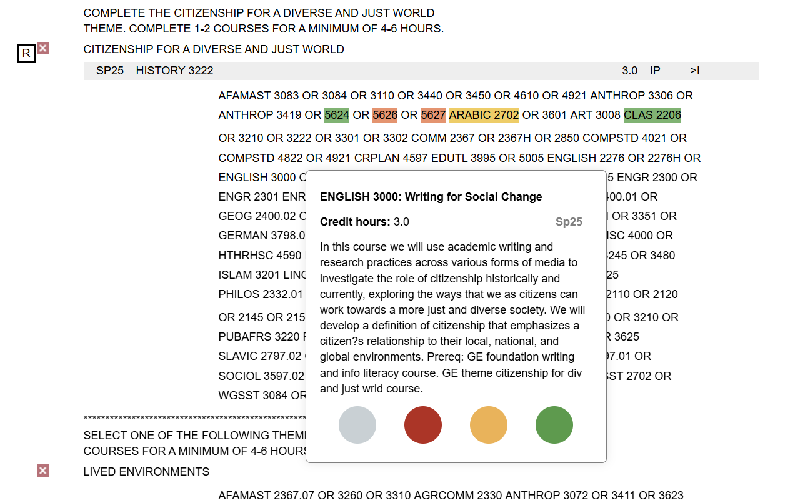

# Class Glass

Class Glass is a browser extension to make reading The Ohio State University Degree Audits easier by displaying the name of a course along with it's course number.

## Installation

### Chrome

Class Glass is available via the [Chrome Web Store](https://chromewebstore.google.com/detail/class-glass/finhcgdnghbpikcplaodjdlclonjblfj)

### Edge

Class Glass is available via the [Edge Add-Ons Store](https://microsoftedge.microsoft.com/addons/detail/class-glass/khkgpilhhafnmohaejgpdjaioinmohfk)

### Firefox

Mozilla web store [does not distribute add-ons which are only accessible to a closed user group](https://extensionworkshop.com/documentation/publish/add-on-policies/), but it does approve them for manual distribution.

1. Download [65c9dc0e79e845739622-1.0.xpi](65c9dc0e79e845739622-1.0.xpi?raw=true) (which is approved and signed by Mozilla, hence the weird name).
2. Go to [about:addons](about:addons)
3. Settings cog -> Install Add-on from file

### Safari ❌

Safari is not supported because development requires a Mac and I don't have one. You could probably get it working if you follow [the conversion steps](https://developer.apple.com/documentation/safariservices/converting-a-web-extension-for-safari).

### Other browsers

If you use another browser, you may be able to install Class Glass by enabling developer mode and installing the extension from source. Download this repo and google "developer add-on installation" for whatever browser you use.

## How does it work?

Every time you hover over a class, the extension queries the `https://content.osu.edu/v2/classes/search` api, which returns up-to-date information about each course.

This is the same API that [https://classes.osu.edu/](https://classes.osu.edu/) uses on the backend. It is not documented and not really intended for external use. It may be changed at any time, which would break this extension. Please file an issue if this happens.

An example query looks like: [https://content.osu.edu/v2/classes/search?q=2221&campus=col&p=1&subject=cse](https://content.osu.edu/v2/classes/search?q=2221&campus=col&p=1&subject=cse)
